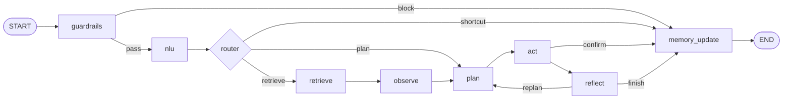

# 可观测电商客服 Agent（LangGraph 复刻）

作品集级 Demo：**零 API Key 可跑通**（`LLM_PROVIDER=fake` + 哈希向量），也可一键切换 OpenAI / DeepSeek / Ollama。实现简历中的 **Guardrails → NLU → Retrieve → Observe → Plan → Act → Reflect → Memory** 可观测链路，混合检索 RAG（BM25 + 向量 + RRF）+ **Topic/Keyword 置顶**，以及 **120 条**端到端评测集与 **6 项**量化指标。

## 架构



- **Deterministic**：单轮线性图（`src/graph/deterministic_graph.py`）
- **ReAct**：在 `reflect` 后允许回到 `plan`（`src/graph/react_graph.py`）
- **敏感操作**：`refund_request` 先 dry-run，再由 UI / API 传入 `confirm_decision=approve` 完成

## 快速开始

```bash
cd ecommerce-cs-agent
python3 -m venv .venv && source .venv/bin/activate   # 可选
pip install -r requirements.txt

# 1) 生成 mock 数据（商品 / 订单 / FAQ）
python scripts/generate_mock_data.py

# 2) （可选）索引冒烟测试
python scripts/build_index.py

# 3) 生成 120 条评测集
python scripts/generate_eval_dataset.py

# 4) 单元测试
pytest tests/ -q

# 5) 端到端评测（Memory On）
python scripts/run_eval.py --memory on --prefix eval_mem_on

# 6) Memory Off 基线（用于 Memory Gain）
python scripts/run_eval.py --memory off --prefix eval_mem_off
```

### Streamlit 前端

```bash
pip install streamlit
streamlit run apps/streamlit_app.py
```

### FastAPI 骨架

```bash
uvicorn apps.api_server:app --reload --port 8000
```

## 环境变量

复制 `.env.example` 为 `.env`。默认 `LLM_PROVIDER=fake` 无需密钥。切换真实模型时设置 `LLM_API_KEY` / `LLM_BASE_URL` / `LLM_MODEL`。

可选 LangSmith：`LANGSMITH_TRACING=true` 并配置 `LANGSMITH_API_KEY`（与 LangChain 生态一致）。

## 评测指标（最近一次本地跑分）

在 **120 条** `data/eval_dataset.jsonl` 上，`--memory on` 的典型结果（见 `reports/eval_mem_on_*.md`）：

| 指标 | 数值 |
|------|------|
| Intent Accuracy | 100.00% |
| Slot Accuracy | 99.72% |
| Effective Tool Coverage | 100.00% |
| Effective Args Accuracy | 99.58% |
| Recall@K | 99.72% |
| Pipeline Success Rate | 99.17% |

**Memory 语义一致性**（`memory_recall` 子任务，`memory_recall_consistent`）：

| 模式 | 一致性 |
|------|--------|
| Memory On | 100% |
| Memory Off | 0% |
| **Memory Gain** | **+100%** |

> 说明：`scripts/generate_mock_data.py` 默认生成 **50** 个 SKU 与 **30** 笔订单。

## 与常见开源示例的差异

| 维度 | 官方 Customer Support Tutorial / 社区 Demo | 本项目 |
|------|---------------------------------------------|--------|
| 中文 NLU 模板 | 少或无 | 规则优先 + LLM 兜底 |
| 混合检索 + Topic 置顶 | 少见 | BM25 + 向量 + RRF + `TopicPin` |
| 评测集 + 6 指标报告 | 通常无 | `scripts/run_eval.py` 一键产出 JSON/Markdown |
| 退款确认 HITL | 部分有 | `act` dry-run + 二次 `confirm_decision` |
| 三层 Memory | 多仅 checkpoint | checkpoint + working + SQLite long-term |

## 目录结构

```
ecommerce-cs-agent/
├── apps/                 # Streamlit + FastAPI
├── data/                 # products.json, orders.json, faq/, eval_dataset.jsonl
├── scripts/              # 数据 / 索引 / 评测入口
├── src/
│   ├── graph/            # LangGraph 编排
│   ├── nodes/            # 各阶段节点 + @traced_node
│   ├── retrieval/        # hybrid + topic_pin
│   ├── tools/            # 6 个业务 tool
│   ├── eval/             # metrics + runner
│   └── memory/           # short / working / long
└── tests/
```

## License

MIT（可按需修改）
